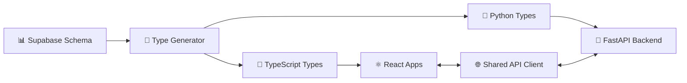

# 🏗️ HexDDD Full-Stack Platform

[](https://github.com/SPRIME01/nx-ddd-hex-plugin/actions/workflows/smoke.yml)
[](https://www.apache.org/licenses/LICENSE-2.0)
[](https://www.typescriptlang.org/)
[](https://www.python.org/)
[](https://nx.dev/)

> 🚀 **The complete full-stack platform** that eliminates architectural chaos with type-safe, domain-driven development across React and Python ecosystems.

## 🎯 Why HexDDD?

**Stop wrestling with:**
- ❌ **Type drift** between frontend and backend
- ❌ **Spaghetti architecture** that becomes unmaintainable
- ❌ **Inconsistent patterns** across team members
- ❌ **Complex setup** for modern full-stack apps
- ❌ **Testing nightmares** with tightly coupled code

**Start shipping with:**
- ✅ **End-to-end type safety** from database to UI
- ✅ **Clean architecture** that scales with your team
- ✅ **Consistent patterns** enforced by tooling
- ✅ **Production-ready** apps in minutes, not weeks
- ✅ **Testable code** with clear boundaries and mocks

## 🌟 What Makes HexDDD Special?

HexDDD is a **batteries-included development platform** that combines:

### 🎯 **Architectural Excellence**
- **Hexagonal Architecture** + **Domain-Driven Design** principles
- **Clean separation** of business logic from infrastructure
- **Port & Adapter** patterns with Protocol-based contracts
- **ESLint-enforced boundaries** prevent architectural violations

### 🔄 **Type Safety Across Languages**
- **Single source of truth** from Supabase/PostgreSQL schema
- **Auto-generated TypeScript** (zod) and **Python** (pydantic) types
- **CI/CD verification** prevents type drift
- **Runtime validation** with compile-time guarantees

### ⚡ **Modern Full-Stack Experience**
- **React frontends**: Next.js, Remix, and Expo with shared client
- **FastAPI backend** with async/await and dependency injection
- **Shared validation layer** across all applications
- **Hot reloading** and **type checking** in development

### 🛠️ **Developer Experience First**
- **Nx generators** for consistent scaffolding
- **Idempotent operations** - safe to run multiple times
- **Comprehensive testing** with Protocol-based mocking
- **Visual dependency graphs** to understand your architecture

## 📁 Architecture Overview

```
🏛️ HEXAGONAL ARCHITECTURE + DDD LAYERS
┌─────────────────────────────────────────────────────────────────┐
│                    🌐 INTERFACE LAYER                          │
│  ┌─────────────┐  ┌─────────────┐  ┌─────────────┐            │
│  │   Next.js   │  │   Remix     │  │    Expo     │            │
│  │   Web App   │  │   Web App   │  │  Mobile App │            │
│  └─────────────┘  └─────────────┘  └─────────────┘            │
│                          │                                     │
│                    📡 Shared API Client                        │
└─────────────────────────────────────────────────────────────────┘
                             │
┌─────────────────────────────────────────────────────────────────┐
│                   ⚙️ APPLICATION LAYER                         │
│  ┌─────────────┐  ┌─────────────┐  ┌─────────────┐            │
│  │  Use Cases  │  │    Ports    │  │  Services   │            │
│  │  Handlers   │  │ (Protocols) │  │    DTOs     │            │
│  └─────────────┘  └─────────────┘  └─────────────┘            │
└─────────────────────────────────────────────────────────────────┘
                             │
┌─────────────────────────────────────────────────────────────────┐
│                    🏗️ INFRASTRUCTURE LAYER                     │
│  ┌─────────────┐  ┌─────────────┐  ┌─────────────┐            │
│  │  FastAPI    │  │  Supabase   │  │   Redis     │            │
│  │  Adapters   │  │ Repository  │  │ Event Bus   │            │
│  └─────────────┘  └─────────────┘  └─────────────┘            │
└─────────────────────────────────────────────────────────────────┘
                             │
┌─────────────────────────────────────────────────────────────────┐
│                     💎 DOMAIN LAYER                            │
│  ┌─────────────┐  ┌─────────────┐  ┌─────────────┐            │
│  │  Entities   │  │ Value       │  │  Domain     │            │
│  │ Aggregates  │  │ Objects     │  │  Events     │            │
│  └─────────────┘  └─────────────┘  └─────────────┘            │
└─────────────────────────────────────────────────────────────────┘
```

## 🗂️ Project Structure

```
📦 nx-ddd-hex-plugin/
├── 🌐 apps/                          # Interface Layer Applications
│   ├── 🔗 backend-api/               # FastAPI service with DI & UoW
│   ├── ⚛️ web-next/                  # Next.js web application
│   ├── 🎵 web-remix/                 # Remix web application
│   └── 📱 web-expo/                  # Expo React Native app
│
├── 📚 libs/                          # Shared Libraries & Domains
│   ├── 🔧 ddd/                       # Nx plugin source (@ddd-plugin/ddd)
│   ├── 🔗 shared/                    # Cross-platform types & clients
│   │   ├── 📊 database-types/        # Generated DB types (TypeScript)
│   │   ├── 🔌 api-types/             # Generated API contract types
│   │   ├── 🌐 web/                   # Shared web client & validation
│   │   └── 🐍 type_system/           # Python type utilities
│   ├── 🐍 backend/                   # Python-specific utilities
│   │   └── ⚙️ type_utils/            # Generated Python types
│   └── 🏗️ <domain>/                  # Domain Boundaries
│       ├── 💎 domain/                # Pure business logic
│       ├── ⚙️ application/           # Use cases & ports
│       └── 🔌 infrastructure/        # Adapters & implementations
│
├── 🛠️ tools/                         # Development Tools
│   ├── 🔄 type-generator/            # Schema-driven type generation
│   └── 🗄️ supabase/                  # Local development stack
│
└── 📋 tests/                         # Test Suites
    ├── 🌊 e2e/                       # End-to-end tests
    ├── 🔗 cross/                     # Cross-language validation
    └── 🧪 fixtures/                  # Test fixtures & examples
```

## 🚀 Quick Start

### 📥 Installation

```bash
# Clone the repository
git clone https://github.com/SPRIME01/nx-ddd-hex-plugin.git
cd nx-ddd-hex-plugin

# Install dependencies
npm install

# Optional: Use Volta for Node.js version management
# volta install node@20.x.x
```

### 🏃‍♂️ Run the Demo Applications

Get started immediately with our reference implementations:

#### 🔗 Backend API (FastAPI)
```bash
nx serve backend-api
# 🌐 Visit: http://localhost:8000
# 📚 API Docs: http://localhost:8000/docs
```

#### ⚛️ Next.js Web App
```bash
nx run web-next:dev
# 🌐 Visit: http://localhost:4200
```

#### 🎵 Remix Web App
```bash
nx run web-remix:dev
# 🌐 Visit: http://localhost:4201
```

#### 📱 Expo Mobile App
```bash
nx run web-expo:start
# 📱 Opens Expo DevTools for iOS/Android
```

> 💡 **Pro Tip**: All frontends share the same type-safe API client and validation schemas, so changes to the backend automatically flow through to all applications!

### 🗄️ Optional: Local Supabase Stack

For full database integration and type generation:

```bash
# Copy environment template
cp example.env .env.supabase.local

# Start local Supabase services
nx run supabase-devstack:start
# 🌐 Supabase Studio: http://localhost:54323

# Later, stop services
nx run supabase-devstack:stop
```

## 🎨 Scaffolding with Nx Generators

Transform your ideas into production-ready code with our intelligent generators:

### 🏗️ Create a New Domain

```bash
# Generate a complete hexagonal domain with all layers
nx g @ddd-plugin/ddd:hex-domain user-management

# Creates:
# - libs/user-management/domain/       (Entities, Value Objects)
# - libs/user-management/application/  (Use Cases, Ports)
# - libs/user-management/infrastructure/ (Adapters, Repositories)
# - Proper ESLint tags and boundaries
```

### 🌐 Add React Applications

```bash
# Next.js application with shared API client
nx g @ddd-plugin/ddd:web-app admin-portal --framework=next

# Remix application reusing shared types
nx g @ddd-plugin/ddd:web-app customer-portal --framework=remix

# Expo mobile app with same contracts
nx g @ddd-plugin/ddd:web-app mobile-app --framework=expo
```

**Generator Options:**
- `name` (required): Project name
- `framework` (required): `next` | `remix` | `expo`
- `apiClient` (default: true): Generate shared API client
- `includeExamplePage` (default: true): Include demo routes
- `routerStyle` (Next.js only): `app` | `pages` router

### 🔧 Domain Extensions

```bash
# Add ports and adapters
nx g @ddd-plugin/ddd:port notification-service

# Add Unit of Work pattern
nx g @ddd-plugin/ddd:uow user-management

# Add Event Bus support
nx g @ddd-plugin/ddd:event-bus user-management
```

> ✨ **Idempotent by Design**: All generators are safe to run multiple times - they'll only make necessary changes, never duplicate or break existing code.

## 🔄 Type Generation & Synchronization

Keep your entire stack in perfect type harmony:

### 🔧 Generate Types from Schema

```bash
# Generate TypeScript + Python types from Supabase schema
nx run type-generator:generate

# Verify type parity between languages
nx run type-generator:verify
```

### 🐍 Python Type Checking

```bash
# Strict mypy validation
npm run type-check:py

# Or target specific files
uv run mypy --strict apps/backend-api/
```

### 🤖 Automated CI Synchronization

Our GitHub Actions workflow automatically:
- ✅ Validates type consistency across languages
- ✅ Generates updated types when schemas change
- ✅ Creates pull requests with type updates
- ✅ Prevents type drift in production

**Workflow triggers:**
- Schema file changes in `supabase/`
- Manual workflow dispatch
- Scheduled weekly verification

## 🎯 Architecture Deep Dive

### 🏛️ Clean Architecture Principles

**Domain Layer** 💎 (Pure Business Logic)
```typescript
// ✅ Framework-agnostic entities and value objects
export class User {
  constructor(
    private readonly id: UserId,
    private readonly email: Email,
    private readonly profile: UserProfile
  ) {}

  updateProfile(newProfile: UserProfile): UserProfileUpdated {
    // Pure business rules - no framework dependencies
    return new UserProfileUpdated(this.id, newProfile);
  }
}
```

**Application Layer** ⚙️ (Use Cases & Ports)
```typescript
// ✅ Orchestrates domain logic with external services
export class UpdateUserProfileUseCase {
  constructor(
    private readonly userRepository: UserRepository,  // Port
    private readonly eventBus: EventBus               // Port
  ) {}

  async execute(request: UpdateProfileRequest): Promise<void> {
    const user = await this.userRepository.findById(request.userId);
    const event = user.updateProfile(request.profile);
    await this.userRepository.save(user);
    await this.eventBus.publish(event);
  }
}
```

**Infrastructure Layer** 🔌 (Adapters & External Services)
```python
# ✅ Implements ports with real external dependencies
class SupabaseUserRepository(UserRepository):
    async def find_by_id(self, user_id: UserId) -> User:
        # Database implementation
        pass

    async def save(self, user: User) -> None:
        # Persistence implementation
        pass
```

### 🔗 Type Safety Across Boundaries



**Benefits:**
- 🛡️ **Compile-time safety** - Catch errors before they reach production
- 🔄 **Automatic synchronization** - Schema changes propagate everywhere
- 🧪 **Testable contracts** - Mock implementations match real interfaces
- 📈 **Scalable patterns** - Add new domains without breaking existing code

## 🧪 Testing & Quality Assurance

### 🏗️ Comprehensive Testing Strategy

```bash
# 🧪 Run all tests across the monorepo
nx run-many --target=test --all

# 🔍 Lint and architectural validation
nx run-many --target=lint --all

# 🐍 Python type checking
npm run type-check:py

# 🌊 End-to-end testing
nx run ddd-e2e:e2e
```

### 🧪 Testing Layers

**Domain Tests** 💎
- ✅ Pure unit tests with no mocking required
- ✅ Business rule validation
- ✅ Domain event verification

**Application Tests** ⚙️
- ✅ Use case testing with Protocol/interface mocks
- ✅ In-memory port implementations for fast feedback
- ✅ Event bus interaction verification

**Infrastructure Tests** 🔌
- ✅ Integration tests with real adapters
- ✅ Contract tests ensuring port compliance
- ✅ Database migration validation

**End-to-End Tests** 🌊
- ✅ Full stack validation through UI
- ✅ API contract verification
- ✅ Type safety across language boundaries

### 🛡️ Quality Gates

**ESLint Boundary Enforcement:**
```json
{
  "rules": {
    "@nx/enforce-module-boundaries": [
      "error",
      {
        "depConstraints": [
          {
            "sourceTag": "type:domain",
            "onlyDependOnLibsWithTags": ["type:domain"]
          },
          {
            "sourceTag": "type:application",
            "onlyDependOnLibsWithTags": ["type:domain", "type:application"]
          }
        ]
      }
    ]
  }
}
```

**Automated Verification:**
- 🤖 **CI Pipeline** validates all boundaries
- 🔍 **Type Drift Detection** prevents schema inconsistencies
- 📊 **Test Coverage** reporting across all layers
- 🚨 **Breaking Change Detection** in API contracts

## 🛠️ Tech Stack & Standards

### Frontend Excellence ⚛️
| Technology | Version | Purpose |
|------------|---------|---------|
| **Next.js** | 14+ (App Router) | 🌐 Full-stack React framework |
| **Remix** | 2.15+ | 🎵 Progressive web apps |
| **Expo** | 54+ | 📱 React Native mobile development |
| **TypeScript** | 5.0+ (Strict) | 🔒 Type-safe development |
| **Zod** | 3.23+ | ✅ Runtime type validation |
| **React** | 19.0 | ⚛️ Component library |

### Backend Power 🐍
| Technology | Version | Purpose |
|------------|---------|---------|
| **FastAPI** | Latest | 🚀 High-performance async API |
| **Python** | 3.11+ | 🐍 Backend development |
| **Pydantic** | 2.x | 📝 Data validation & serialization |
| **SQLAlchemy** | 2.x | 🗄️ Async ORM |
| **mypy** | Latest | 🔍 Static type checking |
| **pytest** | Latest | 🧪 Testing framework |

### Infrastructure & DevOps 🏗️
| Technology | Version | Purpose |
|------------|---------|---------|
| **Nx** | 21.5+ | 🔧 Monorepo tooling |
| **Supabase** | Latest | 🗄️ PostgreSQL + Auth + API |
| **Docker** | Latest | 📦 Containerization |
| **GitHub Actions** | - | 🤖 CI/CD pipelines |
| **ESLint** | Latest | 🔍 Code quality enforcement |

## 🤝 Contributing

We welcome contributions! Here's how to get involved:

### 🔄 Development Workflow

1. **🌿 Branch Strategy**
   ```bash
   # Create feature branch
   git checkout -b feat/your-awesome-feature

   # Or bug fix branch
   git checkout -b fix/specific-issue
   ```

2. **🧪 Quality Checks**
   ```bash
   # Run tests locally
   nx run-many --target=test --all

   # Lint your code
   nx run-many --target=lint --all

   # Type checking
   npm run type-check:py
   ```

3. **📝 Documentation Updates**
   - Update README.md for user-facing changes
   - Update AGENTS.md for architectural changes
   - Add ADRs for significant decisions
   - Update generator schemas for new options

4. **🔄 Generator Development**
   ```bash
   # Test generator idempotency
   nx g @ddd-plugin/ddd:web-app test-app --framework=next
   nx g @ddd-plugin/ddd:web-app test-app --framework=next
   # Should show "no changes" on second run
   ```

5. **📨 Pull Request Guidelines**
   - Provide clear context and motivation
   - Include test evidence and screenshots
   - Document any breaking changes
   - Update type generation if schemas change

### 🎯 Areas for Contribution

- 🎨 **New Framework Support** (Vite, SvelteKit, etc.)
- 🔌 **Additional Adapters** (Redis, Kafka, GraphQL)
- 📱 **Mobile Patterns** (Navigation, offline support)
- 🧪 **Testing Utilities** (Test builders, factories)
- 📚 **Documentation** (Tutorials, examples, guides)
- 🏗️ **Generator Improvements** (More options, better DX)

## 📚 Learn More

### 📖 Essential Reading
- 📋 [**AGENTS.md**](AGENTS.md) - AI agent guidelines and architecture context
- 🏗️ [**ADR Documents**](docs/) - Architectural decisions and rationale
- 📝 [**Product Requirements**](docs/PRD-hex-react-python.md) - Feature specifications
- 🔧 [**Technical Specifications**](docs/TECHSPEC-hex-react-python.md) - Implementation details

### 🎓 Architecture Resources
- 📚 [Hexagonal Architecture](https://alistair.cockburn.us/hexagonal-architecture/) by Alistair Cockburn
- 🏗️ [Domain-Driven Design](https://martinfowler.com/bliki/DomainDrivenDesign.html) by Martin Fowler
- 🔧 [Clean Architecture](https://blog.cleancoder.com/uncle-bob/2012/08/13/the-clean-architecture.html) by Robert Martin
- ⚛️ [React Architecture Patterns](https://reactpatterns.com/) for frontend best practices

### 🛠️ Tool Documentation
- 🔧 [Nx Monorepo Guide](https://nx.dev/getting-started/intro)
- ⚛️ [Next.js Documentation](https://nextjs.org/docs)
- 🎵 [Remix Framework](https://remix.run/docs)
- 🐍 [FastAPI Guide](https://fastapi.tiangolo.com/)

## 📄 License

**MIT License** - see [LICENSE](LICENSE) for complete details.

---

<div align="center">

**🚀 Ready to build something amazing?**

[⭐ Star this repo](https://github.com/SPRIME01/nx-ddd-hex-plugin) • [🐛 Report issues](https://github.com/SPRIME01/nx-ddd-hex-plugin/issues) • [💬 Start discussions](https://github.com/SPRIME01/nx-ddd-hex-plugin/discussions)

**Built with ❤️ by developers, for developers**

</div>
